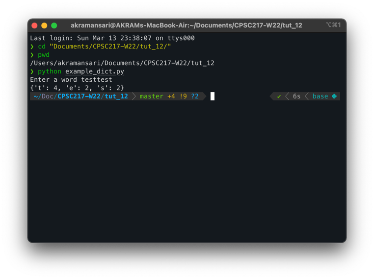

# Tutorial 14

---

### Date: March 14, 2021

### Email: mohdakram.ansari@ucalgary.ca

---

## Agenda

1. Running a python file from the terminal
2. Taking arguments from the terminal
3. Exercise

---
## Running a python file from the terminal

1. Open a terminal
   1. PyCharm Integrated Terminal
   2. Cmd (Windows) / Terminal (MacOS)
2. Go in the directory where your python file is.
   1. Type `pwd` to print the current working directory.
   2. For changing directory type `cd <directory>`
3. Type `python <my_python_file.py>` (with the extension)


---
## Taking arguments from the terminal

When running a python file from the terminal you can pass 
input to your program as arguments.

Sytax
```commandline
python my_file.py <arg_1> <arg_2> <arg_3> ...
```

The arguments can be accessed inside your program using 
`sys.argv` pre-created list. Make sure you have `import sys`
line before you access `sys.argv`.

The first element of this list is the python file name.

The next elements of this list are space separated arguments 
passed to the program.

All arguments are of the str type.

Example:
```python
import sys
print(sys.argv)
```

Output:
```commandLine
$ python example_arg.py arg 1234 test 43.0
['example_arg.py', 'arg', '1234', 'test', '43.0']
```

---
## Exercise

Write a program to calculate the average of all 
numbers passed as argument to the python program.
Expect all arguments to be integers.
